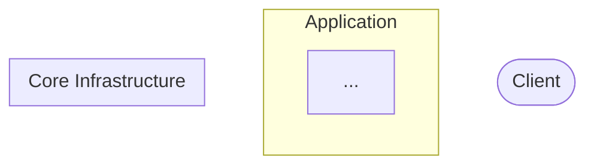
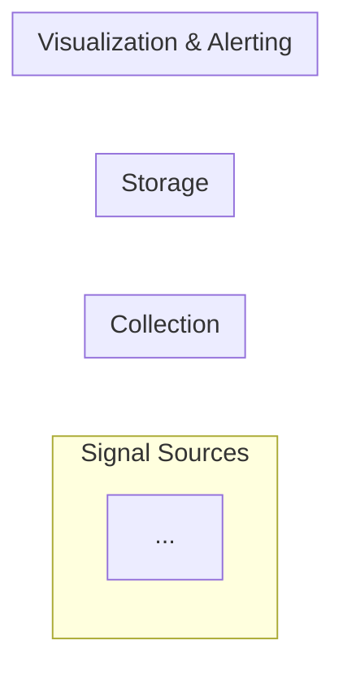

# /infra-diagram 명령어

## Step 1. 파일 읽기

### 1-1. Compose 파일
루트에서 `docker-compose.yml` 또는 `docker-compose.yaml`을 찾아 읽는다.
없으면 "docker-compose 파일을 찾을 수 없습니다" 출력 후 중단한다.

추출 항목:
- 서비스 목록, 이미지/빌드 여부
- 포트 매핑 (`host:container`)
- `depends_on` (기동 순서 및 의존성)
- 환경 변수 중 연결 대상이 담긴 것 (`*_URL`, `*_HOST`, `*_SERVERS`, `*_ADDR` 등)
- 공유 볼륨, 네트워크

### 1-2. monitoring/ 폴더
`monitoring/` 하위의 모든 설정 파일(`*.yml`, `*.yaml`, `*.json`)을 glob으로 목록을 먼저 파악한다.
파일이 많으면 각 파일을 읽되, 다음 항목만 추출하고 나머지는 무시한다:
- 어떤 서비스로 데이터를 보내는지 (exporters, receivers, remote_write 등)
- 어떤 서비스에서 데이터를 받는지 (scrape_configs, targets 등)

## Step 2. docs/infra-diagram.md 생성

스캔 결과를 바탕으로 `docs/infra-diagram.md`를 작성한다.
**파일이 이미 존재하면 덮어쓴다.**

다이어그램 작성 규칙:
- **다이어그램을 2개로 분리한다**: 서비스 토폴로지 / 옵저버빌리티 파이프라인
  - 옵저버빌리티 스택(prometheus, grafana, loki, tempo 등)이 없으면 하나로 합친다
- 방향: 서비스 토폴로지는 `flowchart TD` (계층형), 옵저버빌리티 파이프라인은 `flowchart LR` (파이프라인형)
- 서비스를 역할로 subgraph 분류한다. 분류 기준은 스캔 결과에서 귀납적으로 판단한다
- 포트는 노드 레이블에 포함한다: `svcName["container-name\n:hostPort"]`
- 엣지는 환경 변수·depends_on·monitoring 설정에서 확인된 연결만 그린다
- 엣지 레이블은 용도나 프로토콜을 간단히 표기한다
- 확인되지 않은 연결은 그리지 않는다
- 일회성 init 컨테이너(restart: on-failure, entrypoint가 curl/sh 등)는 생략한다
- 공유 볼륨 경유 등 간접 연결은 점선(`-.->`)으로 표기한다

````markdown
# Infrastructure Diagram
_생성일: YYYY-MM-DD_

## 1. 서비스 토폴로지



---

## 2. 옵저버빌리티 파이프라인



> 점선(`-.->`)은 간접 연결을 나타냄.
````

## Step 3. 완료 보고

```
✅ docs/infra-diagram.md 생성 완료
- 서비스: N개
- 읽은 파일: docker-compose.yml, monitoring/...
```
