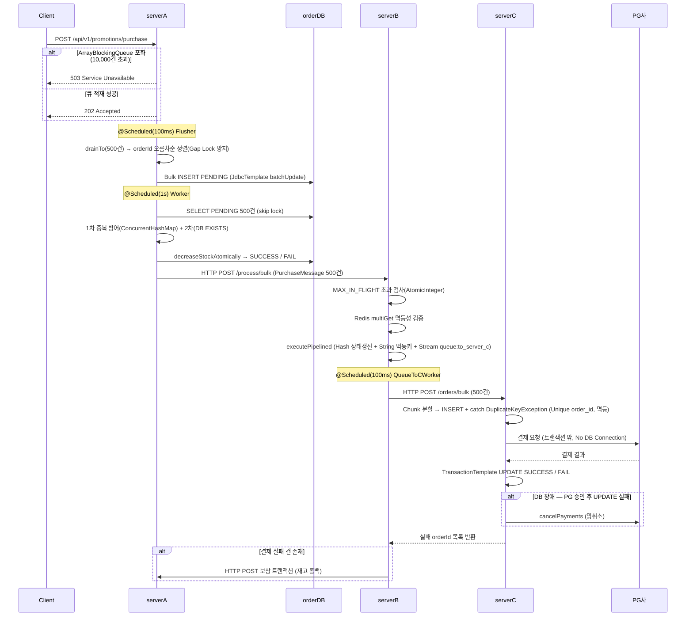
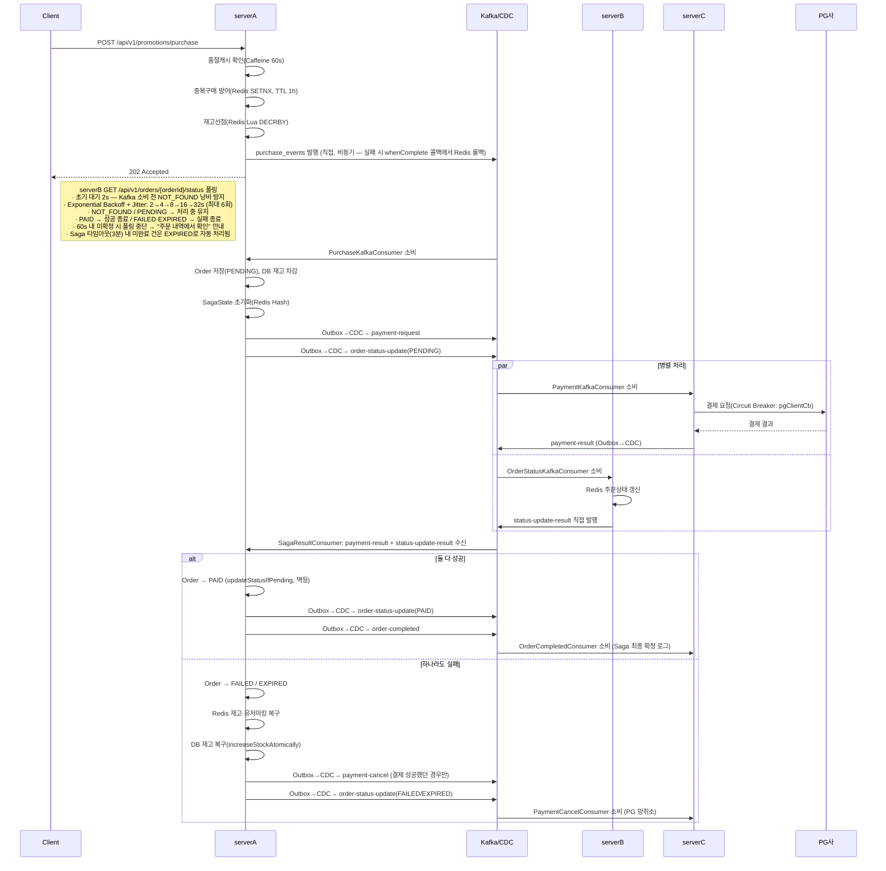
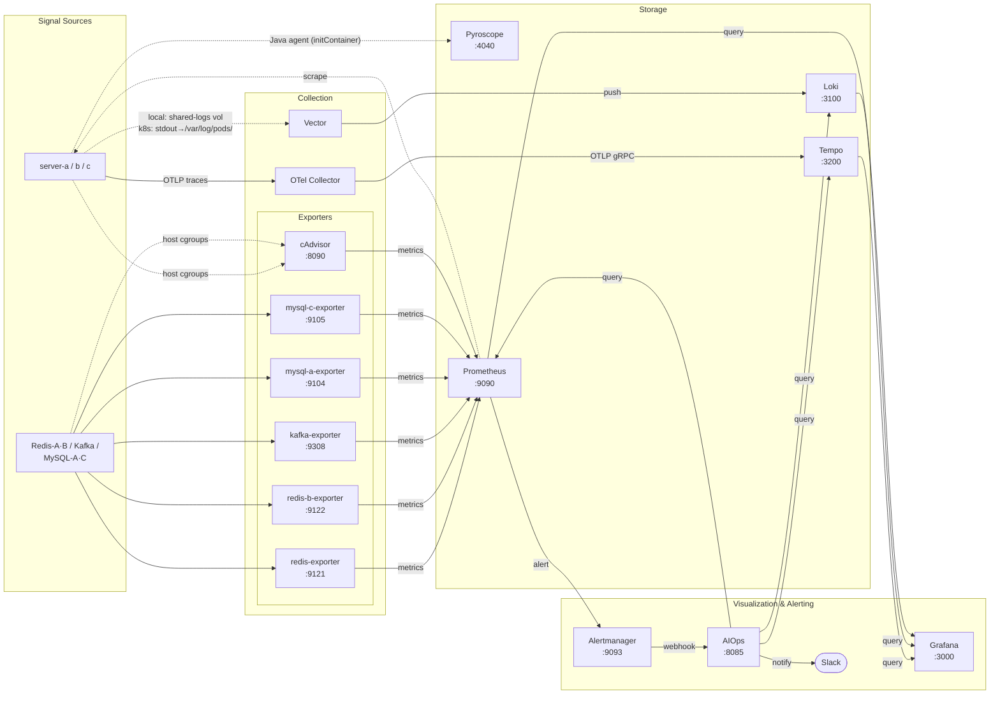

# 굿즈 구매 선착순 프로모션 시스템

> **1vCPU 환경에서 1만 명 동시 선착순 구매를 처리하는 분산 이벤트 시스템**
> Kafka Saga Orchestration · Outbox + Debezium CDC · Redis 3단계 동시성 제어 · CQRS

## 기술 스택

| 분류 | 기술 |
|------|------|
| 언어 / 프레임워크 | Java 21, Spring Boot 3 |
| MSA 인프라 | Spring Cloud Gateway (Redis 토큰버킷 Rate Limiting, JWT 인증 필터), Netflix Eureka (local 전용) |
| 인증 | Spring Security, JWT (Access/Refresh 토큰) |
| 메시지 브로커 | Apache Kafka (KRaft), Debezium CDC |
| 캐시 | Redis, Caffeine |
| 장애 내성 | Resilience4j (Circuit Breaker) |
| AI / AIOps | Spring AI (ChatClient, Tool Calling) |
| 서비스 메시 | Istio |
| DB | MySQL (DB-per-service) |
| 모니터링 | Prometheus, Grafana, Tempo, Loki, Pyroscope, Alertmanager, OpenTelemetry Collector, Vector |
| 부하 테스트 | k6 |
| 로컬 인프라 | Docker Compose |
| 운영 배포 | Kubernetes / Helm (AWS EKS), ALB Ingress, Karpenter (노드 자동 프로비저닝) |
| 보안 | Cloudflare WAF |

---

## 실행 방법

### 로컬 (Docker Compose)

```bash
# 전체 스택 (위 인프라 + 앱 서비스 + 모니터링 포함)
docker compose up -d
```

`SPRING_PROFILES_ACTIVE=local` — Eureka 서비스 디스커버리, 파일 로그(Vector 수집)

| 서비스 | URL |
|--------|-----|
| Gateway (API 진입점) | http://localhost:8088 |
| Discovery (Eureka) | http://localhost:8761 |
| serverA (구매 API) | http://localhost:8080 |
| serverB (조회 API) | http://localhost:8081 |
| serverC (결제 API) | http://localhost:8082 |
| user-service (회원 API) | http://localhost:8086 |
| Grafana | http://localhost:3000 |

### Kubernetes (Helm)

5개 독립 차트 구성: `promotion-app` / `promotion-infra` / `promotion-monitoring` / `promotion-istio` / `promotion-karpenter`

민감값(`datasource.password`, `ingress.certificateArn` 등)은 `helm install --set`으로 주입.  
로컬 테스트용 오버라이드는 `values-local.yaml` 참고.

`SPRING_PROFILES_ACTIVE=k8s` — K8s Service DNS 직접 라우팅(Eureka 제거), stdout 로그(Vector DaemonSet 수집)

---

## 핵심 성과 요약

> 상세 내역은 [성능 개선 히스토리](#성능-개선-히스토리) 참고.

| 단계 | 핵심 변경                      | TPS |   p95    |  DB 처리  |
|------|----------------------------|:---:|:--------:|:-------:|
| Phase 1 시작 — 동기식 기준선 | Server A 단독                | 60 |   18s    |   3분    |
| Phase 1 최종 — 가상 스레드 | 비동기 + Bulk Insert + 가상 스레드 | 630 |   4.3s   |   50초   |
| Phase 2 Kafka 전환 | 서버 간 이벤트화                  | 3,300 |   1.6s   | **15초** |
| Phase 3 핵심 — Lua + Orchestrator | Redis 재고선점 + Saga 일원화      | 7,900 |   1.0s   |   20초   |
| **Phase 3 최종 — CDC 도입** | Debezium binlog 즉시 발행      | **10,300** | **1.5s** | **20초** |

---

## 시스템 아키텍처

### 모듈 구성

| 모듈 | 포트 | 역할                                                                                                                                                               | DB | Redis |
|------|------|------------------------------------------------------------------------------------------------------------------------------------------------------------------|----|-------|
| discovery-service | 8761 | Eureka 서버. **local 전용** — K8s에서는 미배포(K8s Service DNS로 대체)                                                                                                        | 없음 | 없음 |
| gateway-service | 8088 | API Gateway. JWT 인증 필터(GlobalFilter) + IP별 토큰버킷 Rate Limiting (구매 2 req/s · 일반 20 req/s), ALB Ingress TLS termination                                            | 없음 | ✅ (Rate Limiting) |
| serverA | 8080 | Saga 오케스트레이터. 구매 접수·주문 생성·재고 차감·Saga 흐름 제어                                                                                                                       | order DB | ✅ |
| serverB | 8081 | CQRS 읽기 전용. 주문 상태·재고 뷰 조회                                                                                                                                        | 없음 | ✅ |
| serverC | 8082 | 결제 처리(PG 연동). Kafka 소비 전용                                                                                                                                        | payment DB | 없음 |
| aiops | 8085 | AIOps. Prometheus Alertmanager 웹훅 수신 → Spring AI ChatClient + Tool Calling → Slack 보고서 + K8s 조치 승인 요청 (HPA 조정·Helm 롤백·롤링 재시작·Istio 트래픽 시프트·Outlier Detection 조정·Kafka Lag 조회·Istio 메시 상태 조회) | 없음 | 없음 |
| user-service | 8086 | 회원 관리. JWT 로그인·Refresh 토큰 발급·재발급                                                                                                                                 | user DB (3309) | 없음 |

### Before Kafka — Phase 1 최종 아키텍처

> 큐 기반 비동기 + 서버 간 HTTP 직통 구조. **630 TPS / p95 4.3s / DB 처리 50초**
> 상세 데이터 플로우는 [docs/arch-v1.md](docs/arch-v1.md) 참고.



---

### After Kafka — Phase 3 전체 최종 아키텍처



### Kafka 토픽 맵

| 토픽명 | 발행 주체 | 발행 방식 | 소비 모듈 | DLT |
|--------|-----------|-----------|----------|-----|
| `purchase_events` | serverA/PromotionService | 직접(비동기, 실패 시 콜백 롤백) | serverA/PurchaseKafkaConsumer | ✅ |
| `payment-request` | serverA/OrderCommandService | Outbox+CDC | serverC/PaymentKafkaConsumer | ✅ |
| `payment-result` | serverC/PaymentService | Outbox+CDC | serverA/SagaResultConsumer | ✅ |
| `order-status-update` | serverA/OrderCommandService, SagaOrchestratorService | Outbox+CDC | serverB/OrderStatusKafkaConsumer | ✅ |
| `status-update-result` | serverB/OrderStatusEventHandler | 직접 | serverA/SagaResultConsumer | ✅ |
| `order-completed` | serverA/SagaOrchestratorService | Outbox+CDC | serverC/OrderCompletedConsumer | ✅ |
| `payment-cancel` | serverA/SagaOrchestratorService | Outbox+CDC | serverC/PaymentCancelConsumer | ✅ |
| `stock-snapshot` | serverA/PromotionService, SagaOrchestratorService | Outbox+CDC | serverB/StockSnapshotConsumer | ✅ |

### 옵저버빌리티 파이프라인



> 점선(`-.->`)은 간접 연결(공유 볼륨 / Prometheus pull / host cgroups)을 나타냄.

---

## 핵심 설계 결정

### 1. 재고 동시성 — 3단계 방어

DB 락 없이 Redis 3단계로 동시성을 제어한다. 각 단계를 통과한 요청만 다음 단계로 전달해 처리 비용을 줄인다.

| 단계 | 구현 | 역할 |
|------|------|------|
| 1단계 | Caffeine 로컬 캐시 (TTL 60s) | Redis 왕복 없이 품절 즉시 차단 |
| 2단계 | Redis SETNX (`user:purchase:{userId}:{goodsId}`, TTL 1h) | 동일 유저 중복 구매 원천 차단 |
| 3단계 | Redis Lua 스크립트 (`GET → 비교 → DECRBY` 원자적 실행) | 재고 선점. 부족 시 차감 발생 안 함 |

Kafka 발행 실패 시 2·3단계를 즉시 롤백(SETNX 삭제 + INCRBY)해 정합성을 유지한다.

**채택하지 않은 대안:** DB 비관적 락(커넥션 풀 고갈 위험), DB 낙관적 락(충돌 시 재시도 폭탄), Redisson 분산락(락 획득·해제 왕복 오버헤드)

### 2. Outbox + Debezium CDC

Saga 내부 메시지는 `kafkaTemplate.send()` 직접 호출 대신 **Outbox 테이블 INSERT → Debezium CDC → Kafka** 순서로 발행한다.

- **이유:** DB 트랜잭션(Order 저장, 재고 차감)과 메시지 발행을 원자적으로 묶기 위함. 직접 발행은 DB 커밋 후 Kafka 발행 실패 시 메시지 유실 위험이 있다.
- **traceparent 전파:** `outbox_event.traceparent` 컬럼 → Kafka 헤더 자동 주입 → serverC에서 Child Span 생성 → 단일 분산 트레이스 연결


### 3. Saga Orchestration

Choreography 대신 Orchestration을 채택해 serverA가 단독으로 흐름을 제어한다.

```
PromotionService → purchase_events (직접 발행)
       ↓
PurchaseKafkaConsumer → Order(PENDING) 저장 + SagaState 초기화
       ↓ (병렬)
serverC ← payment-request     → payment-result      → SagaResultConsumer
serverB ← order-status-update → status-update-result → SagaResultConsumer
       ↓
성공: Order → PAID, order-completed 발행
실패: Order → FAILED, Redis 복구, payment-cancel 발행 (망취소)
```

- **멱등성 보장:** `updateStatusIfPending()` — PENDING 상태일 때만 변경, 중복 실행 시 0 반환
- **타임아웃:** `SagaTimeoutScheduler`가 30초마다 SCAN → 3분 초과 미완료 Saga → EXPIRED 처리
- **DLT 전략:** 재시도 소진 메시지를 DB `dead_letter` 테이블에 저장, 관리자 수동 재처리 API 제공

### 4. CQRS — serverB 읽기 전용 분리

주문 상태·재고 조회를 serverA가 아닌 serverB(DB 없음, Redis만 사용)에서 처리한다.

- **이유:** 플래시세일 중 쓰기(serverA)와 읽기가 동일 서버에서 경합하면 쓰기 성능 저하
- **트레이드오프:** 최종 일관성 모델 — 주문 직후 상태 조회 시 수십 ms 지연 가능 (의도된 설계)

### 5. AIOps — Spring AI 기반 장애 자동 분석

Prometheus Alertmanager가 웹훅을 AIOps 서버로 발송하면 Spring AI `ChatClient`가 아래 순서로 도구를 호출해 원인을 분석하고 Slack에 보고서를 발송한다.

```
Alertmanager webhook → AIOps(8085)
  ① 중복 억제 (AlertDeduplicationService, 30분 TTL)
  ② ChatClient + ObservabilityTools + KubernetesTools Tool Calling
     [ObservabilityTools]
     - queryPrometheusMetrics  : 에러율·가용성 현황
     - queryDatabaseHealth     : HikariCP 대기·슬로우 쿼리·Redis 메모리
     - queryLokiLogs           : 대상 서비스 최근 5분 ERROR 로그
     - queryTempoTrace         : traceId 추출 시 분산 트레이스 조회
     - queryProfilerHotspots   : 트레이스 지연 원인 불분명·CPU 포화 알람 시 Pyroscope에서 자체 CPU 시간 기준 상위 핫스팟 메서드 조회
     - queryRecentCommits(60)  : 최근 1시간 배포 이력 (장애 시각 10분 이내 커밋 → 롤백 권장)
     - queryKafkaLag           : Kafka consumergroup·topic별 consumer lag 조회 (KafkaConsumerLagHigh 알람 전용)
     [KubernetesTools]
     - getClusterStatus              : K8s 노드·파드·디플로이먼트·HPA 상태 조회 (Karpenter 프로비저닝 현황 포함)
     - getIstioMeshStatus            : Istio VirtualService·DestinationRule 현재 설정 조회 (v1/v2 가중치 파악)
     - proposeHpaPatch               : HPA maxReplicas 조정 Slack 승인 요청
     - proposeHelmRollback           : Helm 릴리즈 롤백 Slack 승인 요청
     - proposeRolloutRestart         : 디플로이먼트 롤링 재시작 Slack 승인 요청
     - proposeTrafficShift           : Istio VirtualService 가중치 조정 Slack 승인 요청 (카나리 v2 격리, v1+v2=100 검증)
     - proposeOutlierDetectionUpdate : Istio DestinationRule outlier detection 임계값 강화 Slack 승인 요청
  ③ 연쇄 장애 추론 (DB 부하 → CDC 지연 → Kafka 블로킹 → HTTP 5xx 등 계층별 인과 서술)
  ④ Slack 보고서 + 필요 시 K8s 조치 승인 버튼 발송
```

- **중복 억제:** 동일 `groupLabels` 지문(fingerprint)으로 30분 내 재발송 차단
- **resolved 처리:** 알람 상태가 `resolved`이면 AI 분석 없이 "정상 회복" 메시지만 발송

---

### 6. 모니터링 — SRE 대시보드 & 알람 체계

#### Grafana SRE 대시보드 (6-Tier 계층 구조)

대시보드는 "비즈니스 임팩트 → 애플리케이션 → 시스템 → 인프라" 순으로 중요도가 높은 지표를 먼저 확인하도록 설계됐다.

| Tier | 범주 | 주요 지표 |
|------|------|----------|
| Tier 1 | Business Impact & SLO | Saga 결제 완료율(SLI), 에러 예산 소진 속도(Burn Rate), 남은 에러 예산 |
| Tier 2 | Application RED | p95 응답 지연, 결제 종단 간 p95 지연(서버A 진입 ~ PAID 확정), 5xx 에러율, 결제 처리량(RPS) |
| Tier 3 | System Saturation | JVM Heap, 가상 스레드 수, CPU 사용률 |
| Tier 4 | Infrastructure | Redis 메모리·CPU·연결 수, Kafka 컨슈머 렉, MySQL 커넥션·슬로우 쿼리·버퍼풀 히트율 |
| Tier 5 | Business Metrics | 결제 시도/성공/실패 RPS, 결제 성공률, 환불 요청 건수·처리 지연 |
| Tier 6 | Resilience | 서킷 브레이커 상태(OPEN/HALF_OPEN), 외부 API 호출 실패율 |

#### Prometheus 알람 규칙 (P0 · P1 · P2 심각도)

| 심각도 | 기준 | 알람 예시 |
|--------|------|----------|
| 🚨 P0 | 즉각 수기 대응 필요 | PG 결제 성공 후 환불 보상 트랜잭션까지 연달아 실패 → 수기 정산 발생 |
| 🔥 P1 | 서비스 중단·SLO 위반 임박 | 인스턴스 다운, 가용성 < 99.9%, Heap > 90%, 서킷브레이커 OPEN, DB 커넥션 풀 포화, MySQL 인스턴스 다운 |
| ⚠️ P2 | 전조 증상·성능 저하 | p95 > 500ms, 결제 종단 간 p95 지연(`PaymentE2ELatencyHigh`) > 2초, 5xx 에러율 > 1% 3분 지속, 카프카 컨슈머 렉 > 500건, CPU > 80%, MySQL 슬로우 쿼리 > 1/s |
| ℹ️ P3 | 자동 최적화 제안 | HPA 과잉 프로비저닝 — 부하 정상화 후 maxReplicas 원복 제안 |

P1 이상 알람은 Alertmanager → AIOps 서버 웹훅을 통해 [AIOps 자동 분석](#5-aiops--spring-ai-기반-장애-자동-분석) 후 Slack으로 보고서가 발송된다.

---

## AI 개발 워크플로우

CLAUDE.md 4원칙(`Think Before Coding` · `Simplicity First` · `Surgical Changes` · `Goal-Driven Execution`)과 도메인별 Skills(`kafka`/`jpa`/`api`/`exception`/`testing`/`k8s`)를 결합해, LLM의 환각·컨벤션 위반·과잉 설계를 억제하고 코드 작성 전 설계 문서(`docs/plan.md`/`context.md`/`checklist.md`)로 의도를 고정하는 자동화 환경을 구축했다.

| 명령어 | 역할 |
|------|------|
| `/plan` | 다파일 작업 착수 전 가정 표면화 → plan/context/checklist 3종 문서 생성 → 승인 게이트 |
| `/pr` | 변경 이력 분석 → PR 제목/본문 초안 작성 → Linear 이슈 연결(`Closes`) |
| `/spec-draft` → `/spec-to-tickets` | 부실한 요구사항 초안을 User Story + Given-When-Then 명세로 다듬은 뒤 Linear 티켓 자동 생성 |
| `/incident` | 장애 사실 수집 → 관련 커밋 조회 → RCA 문서 생성 → 재발 방지 항목 Linear 서브태스크화 |
| `/release-notes` | git log 기반 Conventional Commits 분류 → 버전별 릴리즈 노트 자동 생성 |
| `arch-snapshot` / `infra-diagram` / `codex-review` / `db-migration` / `coverage` | 코드베이스 스냅샷·인프라 토폴로지 자동 생성, 멀티 에이전트 교차 검증, DDL 위험도 분석, 커버리지 등급 자동 분류 |

`plan`/`incident`/`release-notes`는 Linear MCP와 연동되어 이슈 조회·계획서 코멘트·재발 방지 서브태스크 생성을 자동화하며, GitHub-Linear 연동을 통해 PR 생성·머지 시 이슈 상태가 자동 전환된다.

---

## 성능 개선 히스토리

---

### Phase 1. Server A 단독 최적화 (60 → 630 TPS)

**테스트 환경:** 단일 호스트 Docker Compose 전체 스택
(serverA · serverB · serverC + Kafka + MySQL + Redis + Debezium), 각 컨테이너 1vCPU · 2GB 자원 제한
**부하 시나리오:** k6 / 1,000 VU / 20초간 100,000건 스파이크 / 쓰기 100%

| 버전 | 핵심 변경 |   TPS   | p95  |
|------|----------|:-------:|:----:|
| 🔴 V1 | 동기식 기준선 |   60    | 18s  |
| 🟡 V2 | 비동기 큐(BlockingQueue) + Bulk Insert |   370   | 3.9s |
| 🟢 V3 | B+Tree 정렬 최적화 (UUID v7 + Gap Lock 방지) |   460   | 3.9s |
| 🔬 V4~V7 | 격리수준·스레드 풀 튜닝 실험 → 탈락 | 340~400 |  -   |
| 🚀 V8 | Java 21 가상 스레드 | **630** | 4.3s |

---

#### 🔴 V1: 동기식 기준선
요청 수신부터 serverC 최종 처리까지 전체를 동기로 묶은 구조.
- Tomcat 스레드가 DB I/O 내내 점유 → 대규모 트래픽에서 커넥션 풀 고갈
- **결과:** 60 TPS / p95 18s

#### 🟡 V2: 비동기 큐 + Bulk Insert
- `LinkedBlockingQueue`에 적재 후 즉시 202 반환 → Tomcat 스레드 즉시 해제
- `rewriteBatchedStatements=true` + JdbcTemplate batchUpdate → 단일 I/O로 500건 처리
- **결과:** 370 TPS / p95 3.9s 

#### 🟢 V3: B+Tree 인덱스 정렬 최적화
- orderId를 **UUID v7(시간 기반 순차 생성)** 으로 설계했기 때문에, Bulk Insert 전 메모리에서 오름차순 정렬 후 삽입하면 B+Tree 우측 순차 삽입 패턴과 일치해 페이지 분할을 최소화할 수 있다
- 멀티 인스턴스 Scale-out 시 여러 워커가 동시에 랜덤 범위에 Insert할 때 발생하는 Gap Lock 데드락도 예방
- **결과:** 460 TPS / p95 3.9s

#### 🔬 V4~V7: 격리 수준·스레드 풀 튜닝 실험 (탈락)
- 트랜잭션 격리 수준 하향, HTTP Keep-Alive 커넥션 풀 조정 → 유의미한 TPS 상승 없음
- Tomcat max-threads를 200→20·50으로 축소 실험: CPU-bound 환경에서 유리할 것으로 가설 → 오히려 340~400 TPS로 하락

#### 🚀 V8: Java 21 가상 스레드
- I/O 블로킹 구간에서 OS 스레드를 점유하지 않아 스레드 효율 상승
- **결과:** **630 TPS** / p95 4.3s

---

### Phase 2. Kafka 아키텍처 전환 (DB 처리 12분 → 15초)

**테스트 환경:** 단일 호스트 Docker Compose 전체 스택
(serverA · serverB · serverC + Kafka + MySQL + Redis + Debezium), 각 컨테이너 1vCPU · 2GB 자원 제한
**부하 시나리오:** k6 / 1,000 VU / 20초간 100,000건 스파이크 / 쓰기 100% / 재고 100개 DB 처리 완료 시간 병행 측정

> Phase 2에서는 **구 아키텍처(큐 기반·HTTP 직통) 코드로 기준선을 먼저 측정**하고 Kafka 전환 전후를 비교한다. 구 아키텍처 기준선도 serverB·serverC를 포함한 전체 흐름 측정이다.

| 단계 | 핵심 변경                |    TPS    | p95 |   DB 처리    |
|------|----------------------|:---------:|:---:|:----------:|
| 🔴 구 아키텍처 (큐 한도 10,000 유지) | 기준선 유지               |    630    | 4.3s |    50초     |
| 🟠 구 아키텍처 (큐 한도 제거) | 모든 요청 202 수용, 메모리 누적 |   5,700   | 1.3s |  **12분**   |
| 🟡 Kafka 도입 + skip lock | 서버 간 이벤트화            |   2,700   | 2.2s |  **15초**   |
| 🟢 Kafka + 가상 스레드 도입 | I/O 블로킹 해소           | **3,300** | **1.6s** |    15초     |
| 🔬 Kafka 리소스 → Server A (대조) | 단순 리소스 증설            |   4,300   | 1.3s | **1분 30초** |

---

#### 🔴 구 아키텍처 — 큐 한도 유지 (기준선)
- 큐 한도(10,000)를 초과하는 요청은 즉시 503 반환 → 초과분 손실
- **결과:** 630 TPS / p95 4.3s

#### 🟠 구 아키텍처 — 큐 한도 제거
- 모든 요청을 메모리 큐에 수용 → 202 응답률 급상승(5,700 TPS)
- 그러나 대량의 요청이 DB로 한꺼번에 몰리며 DB 경합으로 최종 처리에 **12분** 소요
- **결론:** 큐 한도 조정만으로는 근본 해결 불가. Kafka 전환 결정

#### 🟡 Kafka 도입 + skip lock 스케줄러
- 서버 간 이벤트를 HTTP 직통 대신 Kafka 토픽으로 전달
- Outbox 폴링 스케줄러에 skip lock 적용 → 다중 인스턴스 중복 발행 방지
- **결과:** 2,700 TPS (이전 대비 약 4.3배 증가) / p95 2.2s (이전 대비 약 2배 단축) / DB 처리 **15초** (이전 대비 12분 → **48배 단축**)
- TPS가 구 아키텍처보다 낮아 보이지만, 구 아키텍처의 5,700 TPS는 "202 응답을 반환했을 뿐 DB 처리가 12분 걸리는 상태"였음. 실질 처리량 기준으로는 Kafka 도입이 월등히 우세

#### 🟢 가상 스레드 도입으로 3,300 TPS 달성
- Kafka 기반 전체 스택에서도 가상 스레드 도입 시 2,700 → **3,300 TPS** 향상
- Phase 1에 이어 전체 스택에서도 I/O 블로킹 해소 효과 확인
- **결과:** 3,300 TPS (이전 대비 약 1.2배 증가) / p95 1.6s (이전 대비 약 1.4배 단축) / DB 처리 15초

#### 🔬 대조 실험 — Kafka 리소스를 Server A에 직접 증설
Kafka 브로커 리소스를 Server A에 할당 시 4,300 TPS (이전 대비 약 1.3배 증가) / p95 1.3s (이전 대비 약 1.2배 단축)로 TPS는 높음
- 그러나 DB 처리는 **1분 30초** — Kafka가 단순 리소스 증설보다 처리 안정성 면에서 6배 우세

---

### Phase 3. 현재 아키텍처 고도화 (3,300 → 10,300 TPS)

**테스트 환경:** Phase 2와 동일
**부하 시나리오:** 쓰기 100% 또는 쓰기 20% / 읽기 80% 혼합 (항목별 상이)

**쓰기 100% 흐름 — 단일 파이프라인 처리량 추적**

| 단계                         | 핵심 변경                 | TPS | p95 | DB 처리 |
|----------------------------|-----------------------|:---:|:---:|:-------:|
| 🔴 Phase 2 최종 (기준선)        | Kafka + 가상 스레드        | 3,300 | 1.6s | 15초 |
| 🚀 Lua + Orchestrator Saga | Redis 재고선점 + Saga 일원화 | **7,900** | **1.0s** | 20초 |
| 🟢 품절 로컬 캐시 사전 필터링         | Caffeine 즉시 차단        | 9,400 | 1.9s | 20초 |
| 🟡 Outbox 폴링               | 비교 기준선                | 9,300 | 1.9s | 20초 |
| 🏁 **CDC 도입 (최종)**         | Debezium binlog 즉시 발행 | **10,300** | **1.5s** | **20초** |

**쓰기 20% / 읽기 80% 혼합 흐름 — CQRS 효과 검증**

| 단계 | 핵심 변경 | TPS | p95 | DB 처리 |
|------|----------|:---:|:---:|:-------:|
| 🟢 CQRS — serverB 읽기 전담 | 읽기/쓰기 경합 제거 | 7,200 | 900ms | 18초 |
| 🔬 대조: serverA 읽기 포함 (리소스 2배) | 읽기·쓰기 경합 발생 | 4,175 | 690ms | 20초 |
| 🟢 품절 로컬 캐시 사전 필터링 | Caffeine 즉시 차단 | **11,600** | **1.6s** | 20초 |

---

#### 🚀 Lua 스크립트 재고선점 + Orchestrator Saga 전환 — 가장 큰 도약
- **기존:** DB 비관적 락(SELECT FOR UPDATE)으로 재고 검증 → DB 커넥션 점유 시간 길고 락 경합 심각
- **개선:** Redis Lua 스크립트로 요청 단계에서 재고를 원자적으로 선점 → 재고 부족 시 Kafka에도 쌓지 않아 하위 서버 불필요 부하 제거
- **기존:** Choreography Saga → 서버 간 직접 보상, 흐름 추적 어려움, 보상 누락 위험
- **개선:** Orchestration Saga → serverA 단독 제어, 보상 트랜잭션 일원화
- **결과:** 3,300 → **7,900 TPS** / p95 1.0s (**2.4배 상승**)
- **DB 처리 15초 → 20초 이유:** Saga Orchestration 도입으로 주문당 Outbox 레코드 수가 증가(payment-request·order-status-update·order-completed 등 최대 3건)하고 SagaState 초기화·갱신 쓰기가 추가돼 총 DB 쓰기량이 Phase 2 대비 증가. 단, TPS가 2.4배 향상된 점을 고려하면 단위 시간당 처리 효율은 오히려 개선됨

#### 🟢 CQRS 효과 실측 검증 
- serverB(Redis 전용)로 읽기를 전담시킨 경우: **7,200 TPS** / p95 900ms
- serverA에 읽기까지 몰아준 경우(리소스 2배): **4,175 TPS** / p95 690ms
- **결론:** CQRS 분리가 리소스 2배 증설보다 TPS 기준 **1.7배** 효과적. 읽기·쓰기 경합이 핵심 병목임을 실증

#### 🟢 품절 로컬 캐시 사전 필터링 — 최대 TPS 구간
- 구매 요청과 재고 조회 모두 품절 플래그를 Caffeine 로컬 캐시(60s)에서 1차 필터링
- 이미 품절된 상품에 대한 Redis·Kafka·DB 접근 자체를 원천 차단
- **결과 (쓰기 20%/읽기 80%):** **11,600 TPS** / p95 1.6s (혼합 부하 최대치)
- **결과 (쓰기 100% 재측정):** 9,400 TPS / p95 1.9s

#### 🟡 Outbox 폴링 → 🏁 Debezium CDC 전환
- **폴링 방식 기준선:** 9,300 TPS / p95 1.9s
  - 스케줄러 주기 동안 발행 지연, 폴링 쿼리 자체가 DB 부하
- **CDC 전환 후:** **10,300 TPS** / p95 **1.5s** / DB 처리 20초
  - MySQL binlog 감지 → Debezium → Kafka 즉시 발행
  - DB 폴링 부하 제거, `traceparent` 헤더 자동 주입으로 분산 트레이싱 연결
  - 폴링 대비 TPS +10.7%, p95 0.4초 단축
