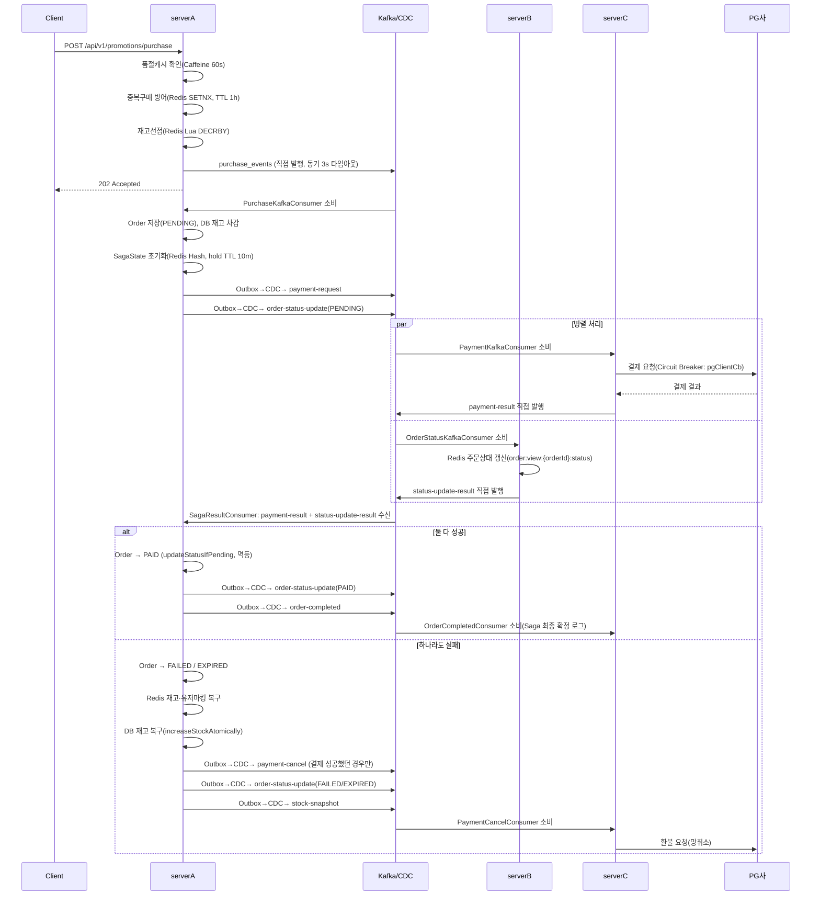

# Architecture Snapshot
_생성일: 2026-05-28_

---

## 모듈 구성

| 모듈 | 포트 | 역할 | DB | Redis |
|------|------|------|----|-------|
| serverA | 8080 | Saga 오케스트레이터. 구매 접수·주문 생성·재고 차감·Saga 흐름 제어 | promotion DB (3307) | ✅ |
| serverB | 8081 | CQRS 읽기 전용. 주문 상태·재고 뷰 조회 | 없음 | ✅ (port 6380) |
| serverC | 8082 | 결제 처리(PG 연동). Kafka 소비 전용, HTTP 엔드포인트 없음 | payment DB (3308, 전용 MySQL) | 없음 |
| mcp | - | AIOps 모니터링. Prometheus 웹훅 수신·장애 분석·Slack 알림 | - | - |

---

## Kafka 토픽 맵

| 토픽명 | 발행 주체 | 발행 방식 | 소비 모듈·클래스 | 파티션 | DLT |
|--------|-----------|-----------|-----------------|--------|-----|
| `purchase_events` | serverA/PromotionService | 직접(동기 3s) | serverA/PurchaseKafkaConsumer | 3 | ✅ |
| `purchase_events.DLT` | Kafka 자동 | - | serverA/PurchaseDltConsumer | 1 | - |
| `payment-request` | serverA/OrderCommandService | Outbox+CDC | serverC/PaymentKafkaConsumer | 3 | ✅ |
| `payment-result` | serverC/PaymentService | 직접 | serverA/SagaResultConsumer | 3 | ✅ |
| `order-status-update` | serverA/OrderCommandService, SagaOrchestratorService | Outbox+CDC | serverB/OrderStatusKafkaConsumer | 3 | ✅ |
| `status-update-result` | serverB/OrderStatusEventHandler | 직접 | serverA/SagaResultConsumer | 3 | ✅ |
| `order-completed` | serverA/SagaOrchestratorService | Outbox+CDC | serverC/OrderCompletedConsumer | 3 | ✅ |
| `payment-cancel` | serverA/SagaOrchestratorService | Outbox+CDC | serverC/PaymentCancelConsumer | 3 | ✅ |
| `payment-cancel.DLT` | Kafka 자동 | - | serverC/PaymentCancelConsumer.handleDlt | 1 | - |
| `stock-snapshot` | serverA/PromotionService, SagaOrchestratorService | 직접(fire-and-forget) / Outbox+CDC | serverB/StockSnapshotConsumer | 3 | ✅ |

---

## 전체 이벤트 흐름 다이어그램

---

## 주요 엔티티

| 모듈 | 엔티티 | 핵심 필드 | 비고 |
|------|--------|-----------|------|
| serverA | `Order` | orderId(UK), userId, goodsId, quantity, status(ENUM), paymentMethod, shippingAddress | status: PENDING/PAID/FAILED/EXPIRED |
| serverA | `Goods` | id, name, stock | 재고 원본(DB) |
| serverA | `DeadLetter` | orderId, goodsId, quantity, reason | DLT 실패 메시지 저장 |
| serverA | `OutboxEvent` | aggregateId, topic, payload, traceparent | Debezium CDC 발행 원본 |
| serverC | `Payment` | orderId(UK), userId, goodsId, quantity, status, paymentMethod | Saga 완료 후 결제 확정 기록 (테이블: payments) |
| serverC | `OutboxEvent` | aggregateId, topic, payload, traceparent | Debezium CDC 발행 원본 |

---

## API 엔드포인트 및 보안 경계

인증 설정 없음 (SecurityConfig 파일 없음 — 전체 퍼블릭으로 추정)

### serverA (8080)
| 메서드 | URL | 설명 | 인증 |
|--------|-----|------|------|
| POST | /api/v1/promotions/purchase | 구매 요청 접수 (202 즉시 반환, 비동기 처리) | 퍼블릭 |
| POST | /api/v1/goods | 상품 생성 | 퍼블릭 |
| POST | /api/v1/admin/dlt/{dltId}/retry | DLT 메시지 수동 재처리 | 퍼블릭 (인증 없음 주의) |

### serverB (8081)
| 메서드 | URL | 설명 | 인증 |
|--------|-----|------|------|
| GET | /api/v1/orders/{orderId}/status | 주문 상태 조회 (Redis 뷰) | 퍼블릭 |
| GET | /api/v1/goods/{goodsId}/stock | 재고 뷰 조회 (Caffeine+Redis) | 퍼블릭 |

### serverC (8082)
| 메서드 | URL | 설명 | 인증 |
|--------|-----|------|------|
| GET | /api/v1/payments/{orderId} | 주문 ID로 결제 단건 조회 | 퍼블릭 |
| GET | /api/v1/payments/users/{userId} | 사용자별 결제 내역 (page, size 파라미터) | 퍼블릭 |

---

## Redis 사용 구조

| 모듈 | 키 패턴 | 저장 데이터 | TTL | 용도 |
|------|---------|------------|-----|------|
| serverA | `goods:stock:{goodsId}` | 재고 수량(Long) | 없음 | 재고 선점 원본 (주 저장소) |
| serverA | `user:purchase:{userId}:{goodsId}` | "1" (플래그) | 1시간 | 중복 구매 방어 |
| serverA | `saga:state:{orderId}` | Hash(userId, goodsId, quantity, 완료플래그 등) | 없음 (명시적 삭제) | Saga 진행 상태 추적 |
| serverA | `saga:hold:{orderId}` | "HOLDING" | 10분 | Saga 소프트 홀드 (타임아웃 감지용) |
| serverB | `order:view:{orderId}:status` | 상태 문자열 | 없음 | 주문 상태 읽기 뷰 |
| serverB | `goods:view:stock:{goodsId}` | 재고 수량 문자열 | 없음 | 재고 읽기 뷰 |

**Caffeine 로컬 캐시 (서버 내 메모리)**

| 모듈 | 대상 | TTL | 용도 |
|------|------|-----|------|
| serverA | 품절 goodsId | 60초 고정 | Redis 왕복 없이 즉시 품절 차단 |
| serverB | 재고 뷰 goodsId | 재고 0이면 5초, 판매중이면 500ms | 재고 조회 트래픽 방어 |

---

## 스케줄러 및 배치 잡

| 모듈 | 클래스명 | 주기 | 역할 |
|------|----------|------|------|
| serverA | `SagaTimeoutScheduler` | fixedDelay=60초 | `saga:state:*` SCAN → 10분 초과 미완료 Saga → EXPIRED 처리 |
| serverA | `OutboxCleanupScheduler` | fixedDelay=3600초 | `outbox_event` 24시간 이전 행 삭제 |
| serverC | `OutboxCleanupScheduler` | fixedDelay=3600초 | `outbox_event` 24시간 이전 행 삭제 |

---

## 외부 시스템 의존성

| 모듈 | 클래스 | 대상 | Circuit Breaker | 실패 처리 |
|------|--------|------|-----------------|-----------|
| serverC | `PgClient` (interface) | PG사 결제 API | ✅ `pgClientCb` | DLT 소진 시 `payment_pg_refund_fatal_total` 카운터 증가, 수동 정산 |

---

## 예외 처리 토폴로지

| 모듈 | GlobalExceptionHandler | 처리 예외 |
|------|------------------------|-----------|
| serverA | ✅ | `PromotionException`(상태코드 직접 지정), `BusinessException`(400), `MethodArgumentNotValidException`(400), `Exception`(500) |
| serverB | ✅ | `Exception`(500) 단일 처리 |
| serverC | ✅ | `PgPaymentException`(400, 보상 트랜잭션 트리거용), `Exception`(500) |

**serverA 커스텀 예외 목록:**
`SoldOutException`, `DuplicateOrderException`, `GoodsNotFoundException`, `QueueFullException`, `AlreadyResolvedDltException`, `DltNotFoundException`, `PromotionException`, `BusinessException`

---

## 서버 간 HTTP 호출

| 호출자 | 대상 | Circuit Breaker | 비고 |
|--------|------|-----------------|------|
| serverA | serverB (8081) | `serverBClient` | 설정 존재 |
| serverB | serverC (8082) | `serverCClient` | 설정 존재 |
| serverB | serverA (8080) | `serverAClient` | 설정 존재 |

---

## Debezium CDC 구간

| 커넥터명 | 감시 DB/테이블 | 사용 모듈 |
|---------|--------------|---------|
| `promotion-outbox-connector` | `promotion.outbox_event` (MySQL 3307) | serverA |
| `payment-outbox-connector` | `payment.outbox_event` (MySQL 3308) | serverC |

- **라우팅**: `outbox_event.topic` 컬럼 값 → Kafka 토픽명으로 동적 라우팅 (`${routedByValue}`)
- **traceparent 전파**: `outbox_event.traceparent` 컬럼 → Kafka 헤더 자동 주입 (분산 트레이싱 연속성)

> **codex-reviewer 주의**: `payment-request`, `order-status-update`, `order-completed`, `payment-cancel`, `stock-snapshot`(saga 결과)은 `kafkaTemplate.send()` 직접 호출이 없고 Outbox INSERT → Debezium CDC → Kafka 순서로 발행된다. `purchase_events`와 `stock-snapshot`(구매 접수 시점)만 직접 발행이다.
