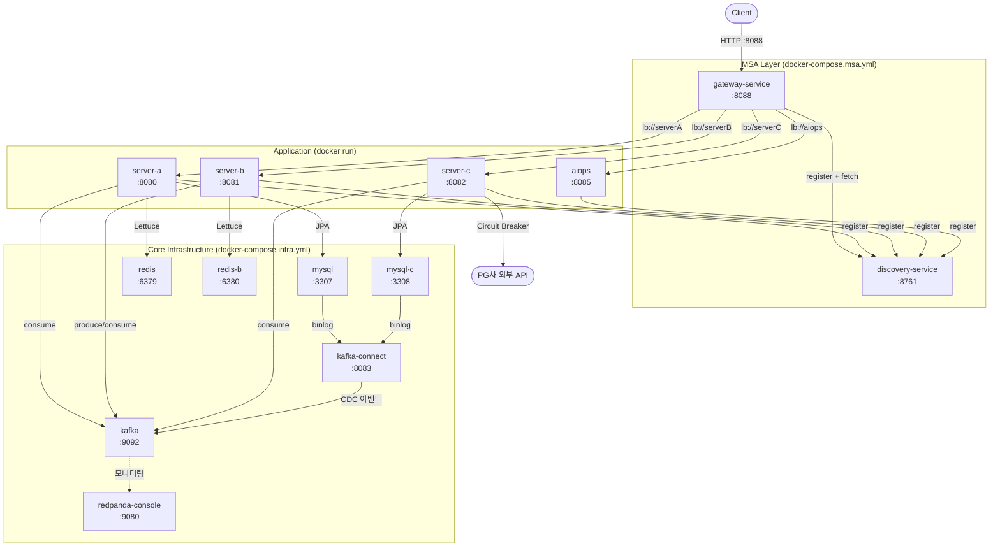
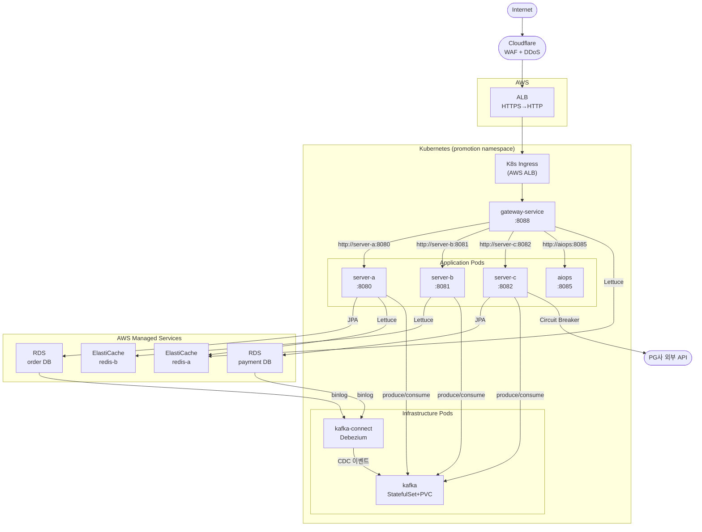
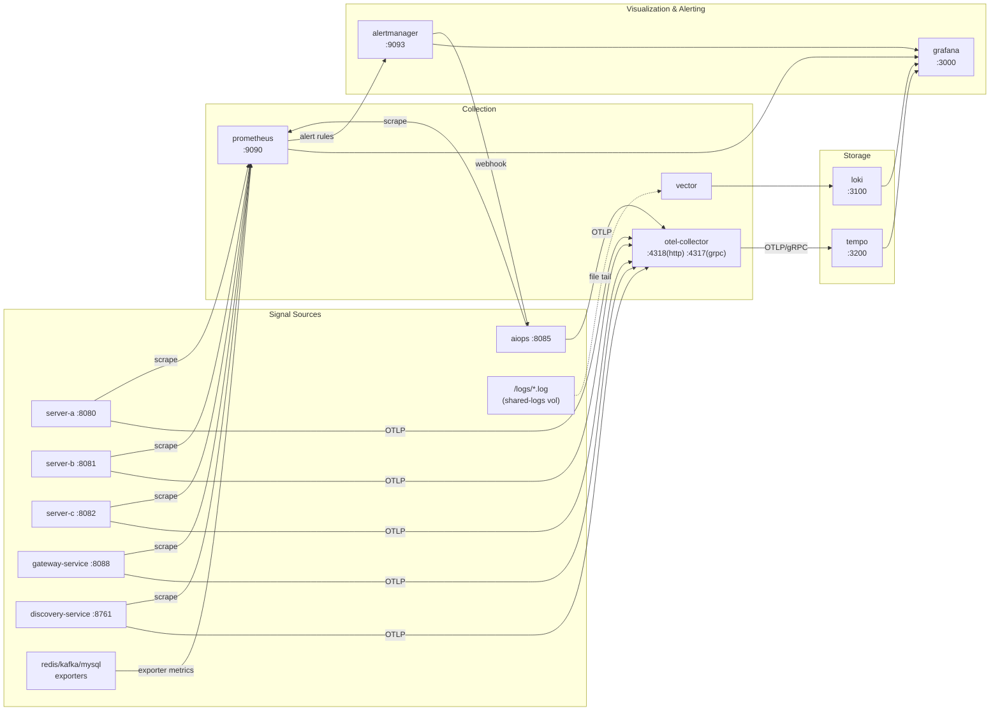

# Infrastructure Diagram
_생성일: 2026-05-29 / 업데이트: 2026-06-06 (Istio Ambient 레이어 추가)_

## 1. 서비스 토폴로지 (local — Docker Compose)

---

## 2. 서비스 토폴로지 (K8s — EKS)

> K8s 환경에서는 Eureka(discovery-service) 미배포. AIOps는 K8s API Server에 RBAC로 접근해 HPA 조정·Helm 롤백·롤링 재시작·Istio VirtualService 트래픽 시프트·DestinationRule Outlier Detection 조정을 Slack 승인 후 실행한다. `SPRING_PROFILES_ACTIVE=k8s`로 K8s Service DNS 직접 사용.
> Istio Ambient: 사이드카 없이 ztunnel(L4 DaemonSet) + waypoint proxy(L7)로 구성. waypoint가 VirtualService 가중치 라우팅과 DestinationRule Outlier Detection을 적용한다. ztunnel/waypoint는 애플리케이션에 투명한 레이어이므로 다이어그램 라우팅에는 표현하지 않음.

---

## 3. 옵저버빌리티 파이프라인

> 점선(`-.->`)은 간접 연결을 나타냄. local: shared-logs 볼륨 경유 / K8s: Vector DaemonSet이 노드 `/var/log/pods/` hostPath 마운트.
