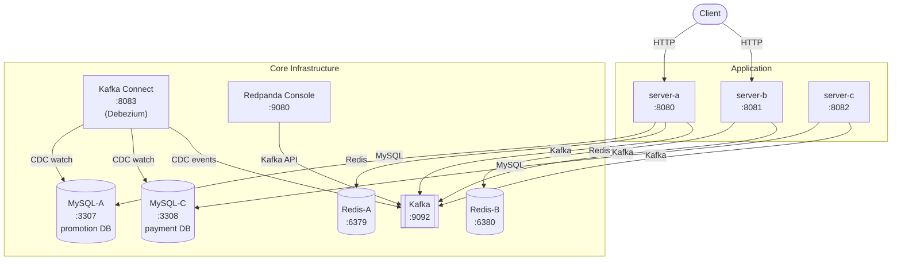
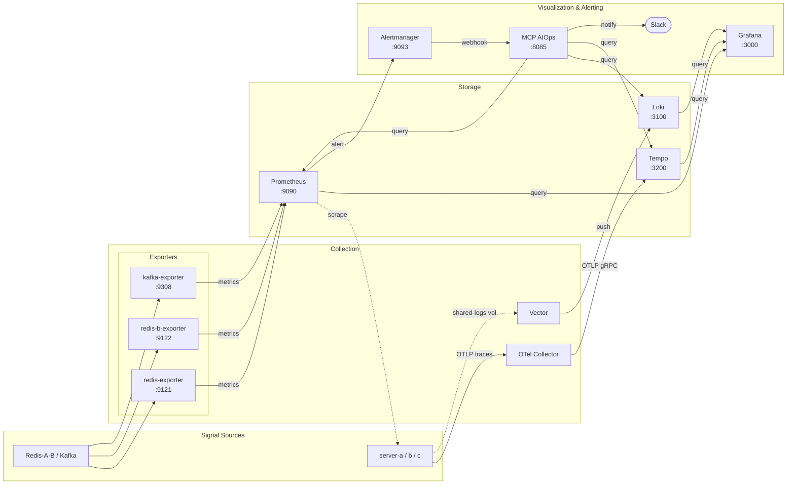

# Infrastructure Diagram
_생성일: 2026-05-28_

## 1. 서비스 토폴로지

```mermaid
flowchart TD
    Client(["Client"])

    subgraph App["Application"]
        svcA["server-a\n:8080"]
        svcB["server-b\n:8081"]
        svcC["server-c\n:8082"]
    end

    subgraph Infra["Core Infrastructure"]
        mysql[("MySQL-A\n:3307\npromotion DB")]
        mysqlC[("MySQL-C\n:3308\npayment DB")]
        redis[("Redis-A\n:6379")]
        redisB[("Redis-B\n:6380")]
        kafka[["Kafka\n:9092"]]
        kafkaConnect["Kafka Connect\n:8083\n(Debezium)"]
        rpConsole["Redpanda Console\n:9080"]
    end

    Client -->|HTTP| svcA
    Client -->|HTTP| svcB

    svcA -->|MySQL| mysql
    svcC -->|MySQL| mysqlC
    svcA -->|Redis| redis
    svcB -->|Redis| redisB
    svcA -->|Kafka| kafka
    svcB -->|Kafka| kafka
    svcC -->|Kafka| kafka

    kafkaConnect -->|CDC watch| mysql
    kafkaConnect -->|CDC watch| mysqlC
    kafkaConnect -->|CDC events| kafka
    rpConsole -->|Kafka API| kafka
```

---

## 2. 옵저버빌리티 파이프라인

```mermaid
flowchart LR
    subgraph Src["Signal Sources"]
        apps["server-a / b / c"]
        infraSrc["Redis-A·B / Kafka"]
    end

    subgraph Collect["Collection"]
        otel["OTel Collector"]
        vector["Vector"]
        subgraph Exp["Exporters"]
            redisExp["redis-exporter\n:9121"]
            redisBExp["redis-b-exporter\n:9122"]
            kafkaExp["kafka-exporter\n:9308"]
        end
    end

    subgraph Store["Storage"]
        tempo["Tempo\n:3200"]
        loki["Loki\n:3100"]
        prometheus["Prometheus\n:9090"]
    end

    subgraph Vis["Visualization & Alerting"]
        grafana["Grafana\n:3000"]
        alertmanager["Alertmanager\n:9093"]
        mcp["MCP AIOps\n:8085"]
        Slack(["Slack"])
    end

    apps -->|OTLP traces| otel
    apps -.->|shared-logs vol| vector
    infraSrc --> redisExp & redisBExp & kafkaExp

    otel -->|OTLP gRPC| tempo
    vector -->|push| loki
    redisExp & redisBExp & kafkaExp -->|metrics| prometheus
    prometheus -.->|scrape| apps

    tempo & loki & prometheus -->|query| grafana
    prometheus -->|alert| alertmanager
    alertmanager -->|webhook| mcp
    mcp -->|query| prometheus & loki & tempo
    mcp -->|notify| Slack
```

> 점선(`-.->`)은 간접 연결(공유 볼륨 / Prometheus pull)을 나타냄.
> `debezium-init`은 일회성 init 컨테이너로 생략.
