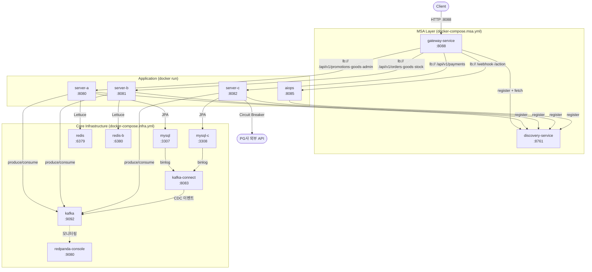
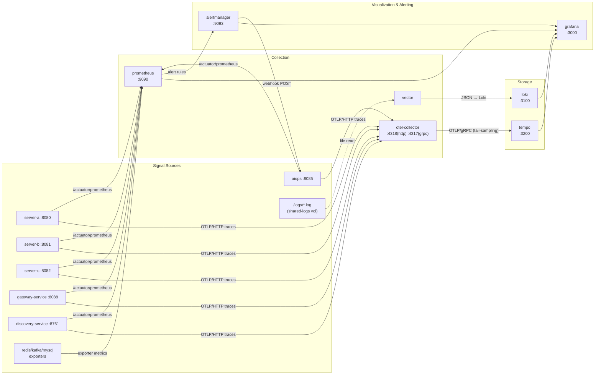

# Infrastructure Diagram
_생성일: 2026-05-29 / 업데이트: 2026-06-04 (gateway-service·discovery-service 추가)_

## 1. 서비스 토폴로지

```mermaid
flowchart TD
    Client(["Client"])

    subgraph MSA["MSA Layer (docker-compose.msa.yml)"]
        GW["gateway-service\n:8088"]
        DS["discovery-service\n:8761"]
    end

    subgraph App["Application (docker run)"]
        A["server-a\n:8080"]
        B["server-b\n:8081"]
        C["server-c\n:8082"]
        AIO["aiops\n:8085"]
    end

    subgraph Infra["Core Infrastructure (docker-compose.infra.yml)"]
        MySQL["mysql\n:3307"]
        MySQLC["mysql-c\n:3308"]
        Redis["redis\n:6379"]
        RedisB["redis-b\n:6380"]
        Kafka["kafka\n:9092"]
        KC["kafka-connect\n:8083"]
        RP["redpanda-console\n:9080"]
    end

    PG(["PG사 외부 API"])

    %% 외부 트래픽
    Client -->|"HTTP :8088"| GW

    %% 게이트웨이 → 서비스 (Eureka lb://)
    GW -->|"lb:// /api/v1/promotions·goods·admin"| A
    GW -->|"lb:// /api/v1/orders·goods·stock"| B
    GW -->|"lb:// /api/v1/payments"| C
    GW -->|"lb:// /webhook·/action"| AIO

    %% Eureka 등록
    GW -->|"register + fetch"| DS
    A -->|"register"| DS
    B -->|"register"| DS
    C -->|"register"| DS
    AIO -->|"register"| DS

    %% 앱 → 인프라
    A -->|"JPA"| MySQL
    A -->|"Lettuce"| Redis
    A -->|"produce/consume"| Kafka
    B -->|"Lettuce"| RedisB
    B -->|"produce/consume"| Kafka
    C -->|"JPA"| MySQLC
    C -->|"produce/consume"| Kafka

    %% Debezium CDC
    MySQL -->|"binlog"| KC
    MySQLC -->|"binlog"| KC
    KC -->|"CDC 이벤트"| Kafka

    %% 외부 결제
    C -->|"Circuit Breaker"| PG

    %% Kafka UI
    Kafka -.->|"모니터링"| RP
```

---

## 2. 옵저버빌리티 파이프라인

```mermaid
flowchart LR
    subgraph Src["Signal Sources"]
        SA["server-a :8080"]
        SB["server-b :8081"]
        SC["server-c :8082"]
        GW["gateway-service :8088"]
        DS["discovery-service :8761"]
        AIO["aiops :8085"]
        Logs["/logs/*.log\n(shared-logs vol)"]
        Infra["redis/kafka/mysql\nexporters"]
    end

    subgraph Collect["Collection"]
        OTEL["otel-collector\n:4318(http) :4317(grpc)"]
        VEC["vector"]
        PROM["prometheus\n:9090"]
    end

    subgraph Store["Storage"]
        Tempo["tempo\n:3200"]
        Loki["loki\n:3100"]
    end

    subgraph Vis["Visualization & Alerting"]
        Grafana["grafana\n:3000"]
        AM["alertmanager\n:9093"]
    end

    %% Traces: 앱 → otel-collector → tempo
    SA & SB & SC & GW & DS & AIO -->|"OTLP/HTTP traces"| OTEL
    OTEL -->|"OTLP/gRPC (tail-sampling)"| Tempo

    %% Logs: shared-logs → vector → loki
    Logs -.->|"file read"| VEC
    VEC -->|"JSON → Loki"| Loki

    %% Metrics: prometheus scrape
    SA & SB & SC & GW & DS & AIO -->|"/actuator/prometheus"| PROM
    Infra -->|"exporter metrics"| PROM

    %% Grafana datasources
    PROM --> Grafana
    Tempo --> Grafana
    Loki --> Grafana
    AM --> Grafana

    %% Alerting
    PROM -->|"alert rules"| AM
    AM -->|"webhook POST"| AIO
```

> 점선(`-.->`)은 간접 연결(shared-logs 볼륨 경유)을 나타냄.
